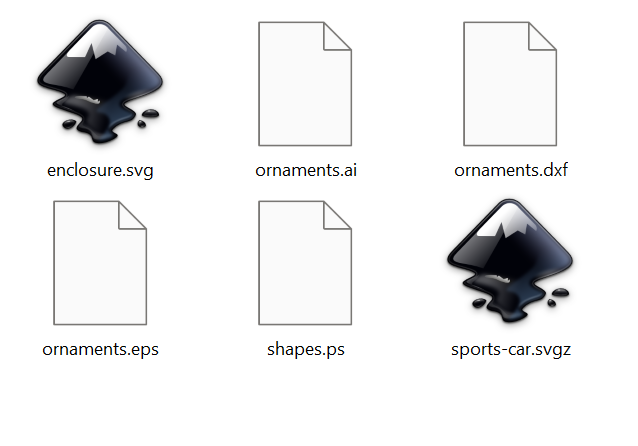
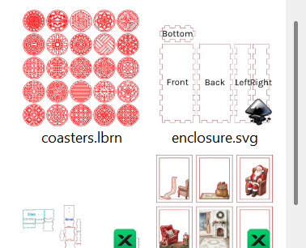

# Vector Thumbnail Handler

**Windows Explorer thumbnails for vector files: SVG, SVGZ, AI, EPS, PS, DXF, PDF, XCS, XS, CDR and LightBurn**

🇩🇪 [Deutsche Version → README.de.md](README.de.md)

Windows Explorer shows only a blank page (or the associated app's generic icon) for most vector formats. This shell extension makes Explorer display an actual preview of the file content — the same idea as LightBurn's thumbnail handler for `.lbrn`, but for the vector formats used in laser cutting, engraving and design.

| Before | After |
|:---:|:---:|
|  |  |

## Supported formats

| Format | How the preview is produced |
|---|---|
| **SVG** | Rendered directly with the built-in Direct2D SVG engine |
| **SVGZ** | Transparently gunzipped, then rendered as SVG |
| **AI** (Adobe Illustrator) | Modern `.ai` are PDF inside → rendered with the Windows PDF engine. CorelDRAW / "no PDF content" exports fall back to the embedded `%AI7_Thumbnail` preview, or Ghostscript |
| **EPS** | Embedded TIFF/WMF preview (DOS‑EPS) or EPSI preview; otherwise Ghostscript |
| **PS** (PostScript) | Rendered with Ghostscript |
| **DXF** | Drawn by a built-in 2D renderer: lines, polylines (incl. bulge arcs), circles, arcs, ellipses, splines and block references |
| **PDF** | Rendered with the Windows PDF engine |
| **XCS / XS** (xTool Studio) | Extracts the preview image xTool embeds in the project file — the JSON `.xcs` format and the newer ZIP-based `.xs` format |
| **CDR** (CorelDRAW) | Extracts the embedded preview bitmap — both the modern ZIP container and the older RIFF format |
| **LightBurn** (`.lbrn`, `.lbrn2`) | Extracts the preview image LightBurn embeds in the project |

> **DWG** (AutoCAD) is planned for a future release. Modern DWG hides its preview in a compressed section that needs a dedicated decoder.

> **Ghostscript is optional.** SVG, SVGZ, DXF, most AI and EPS-with-preview work out of the box. Only `.ps`, and `.ai`/`.eps` files that contain *no* embedded preview, need [Ghostscript](https://ghostscript.com/releases/gsdnld.html) (free). If it is installed, the handler finds and uses it automatically.

- No dependencies beyond Windows itself (and optional Ghostscript)
- Works with old and new file variants
- Corrupt or oversized files (> 256 MB) are ignored gracefully — default icon, no crash
- Your **"Open with"** associations are untouched: double-clicking a file still opens whatever program it opened before, whether or not any app is associated

## Installation

1. Download the latest release ZIP from the [Releases page](../../releases) and extract it.
2. Double-click **`install.bat`** and confirm the administrator prompt (UAC).
   It copies the DLL to `C:\Program Files\VectorThumbnail`, registers it, clears the thumbnail cache and restarts Explorer.
3. Open any folder with vector files and set the view to **Medium icons** or larger.

### Uninstall

Double-click **`uninstall.bat`** (also asks for UAC). It removes only *its own* registry entries — thumbnail handlers registered by other programs (Adobe, Inkscape, PowerToys …) are left untouched — then deletes the DLL.

## Building from source

Requires Visual Studio 2022 Build Tools with the C++ workload (or full Visual Studio). Then run:

```
build.bat
```

This produces `build\VectorThumbnailHandler.dll` plus two test tools:

- `vecthumb-test.exe <file> <out.png> [size]` — runs the render pipeline for any supported format and writes a PNG, without touching Explorer.
- `shellcheck.exe <file> <out.png>` — requests the thumbnail through the **Windows shell itself** (`IShellItemImageFactory`, the exact code path Explorer uses) and proves the registration works.

## Technical details

| | |
|---|---|
| CLSID | `{26CB6E50-6E37-40FD-BAC2-D8130CF9E549}` |
| Interfaces | `IInitializeWithStream`, `IThumbnailProvider` |
| Extensions | `.svg .svgz .ai .eps .ps .dxf .pdf .xcs .xs .cdr .lbrn .lbrn2` |
| Registration | `HKLM\Software\Classes\<ext>\ShellEx\{e357fccd-…}` for each extension, plus its ProgId and `SystemFileAssociations` |
| Format detection | Content sniffer (magic bytes), not the file extension |
| Image path | Direct2D + Windows Imaging Component (WIC), Fant scaling |
| Bundled | [miniz](https://github.com/richgel999/miniz) for SVGZ gunzip and CDR/ZIP extraction (MIT, see `src/miniz-LICENSE.txt`) |

### Two things Windows 11 made hard (learned the hard way)

1. **Per-user (HKCU) registration is not enough.** `IShellItemImageFactory` will happily run an HKCU-registered handler — but Explorer itself never activates it. The handler must be registered machine-wide (HKLM), which is why installation needs one UAC prompt.
2. **The DLL must not live in the user profile.** For folders outside the user profile (e.g. a `D:` drive), Windows 11 extracts thumbnails in a sandboxed process that cannot read DLLs under `AppData` (`PATH NOT FOUND`, even though the file exists). Putting the DLL in `C:\Program Files` fixes it.

## Troubleshooting

- **No thumbnails:** view must be *Medium icons* or larger; in Explorer options, *"Always show icons, never thumbnails"* must be **off**.
- **`.ps` / some `.ai` / `.eps` show a blank page:** install [Ghostscript](https://ghostscript.com/releases/gsdnld.html), then re-run `install.bat` to clear the cache.
- **Old icons remain:** run `install.bat` again, or sign out and back in.
- **SmartScreen warning:** the scripts and DLL are unsigned — choose "More info" → "Run anyway", or build from source.

## License

[MIT](LICENSE)
